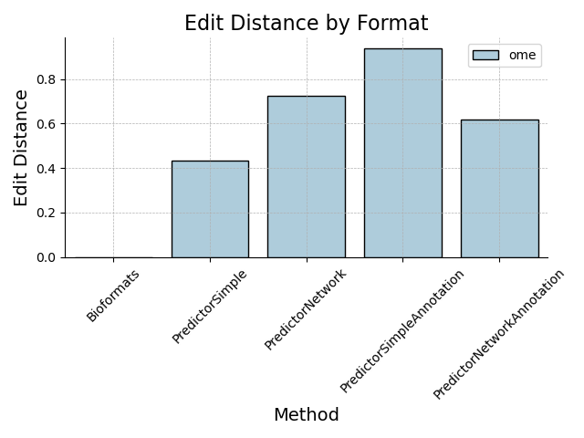
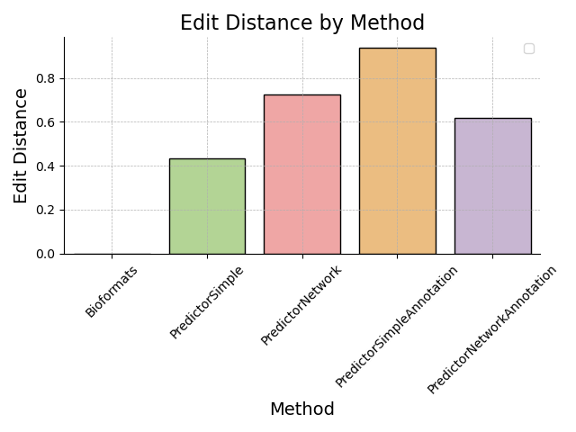
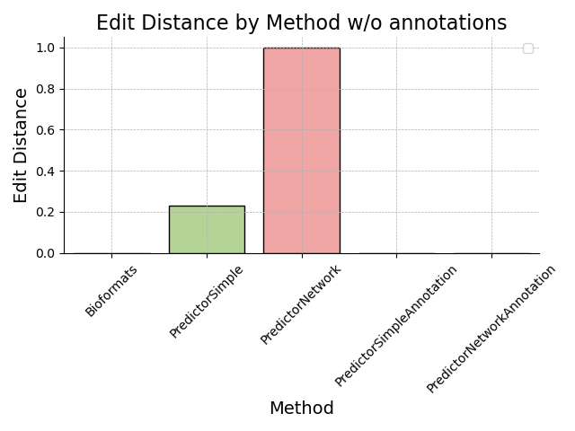
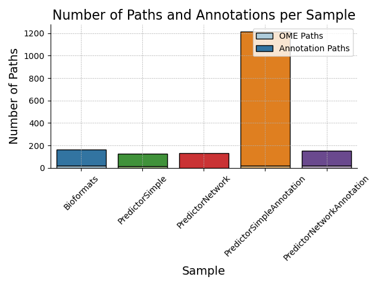
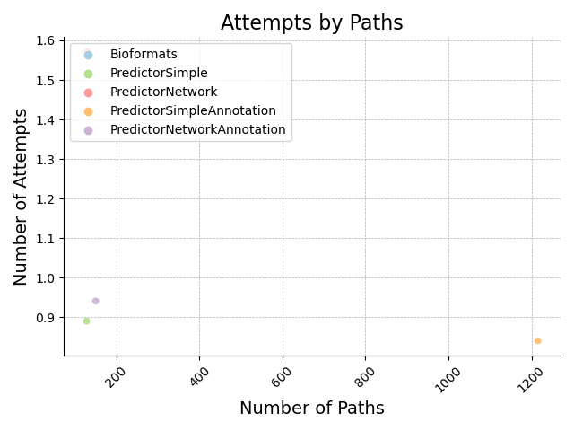
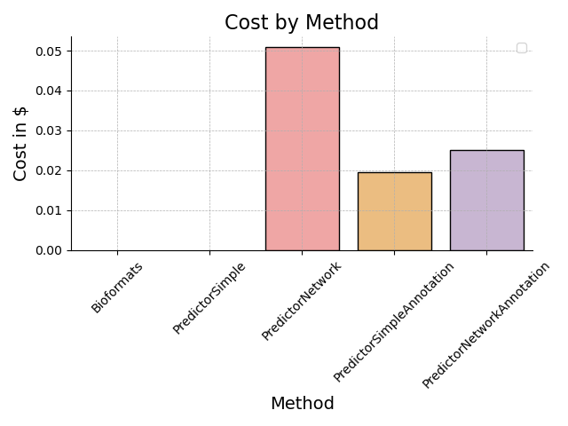
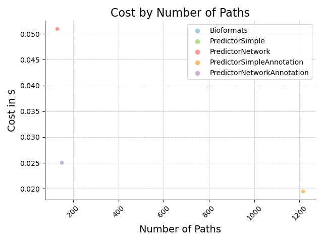
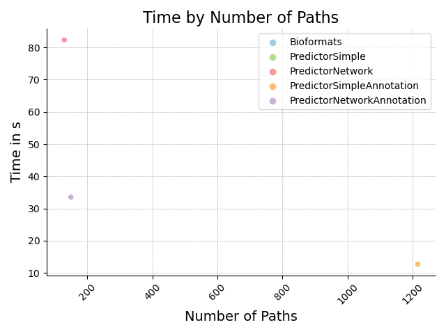

# Results

In this chapter, we present the results of the proposed OME Curater system, a network of agentic GPT-4o instances. The system's ability to effectively capture and structure metadata that is not natively supported by the OME data model is evaluated. We also analyze its potential to completely substitute Bioformats, thereby enabling format-agnostic microscopy research. The findings are organized into sections according to the various performance metrics evaluated: predictiveness, reliability, and usability.

## Predictiveness of OME Curater

The primary measure of predictiveness was the edit distance between the original and predicted metadata. Different methods were utilized to compare the edit distances, providing insight into the accuracy of each approach.

### Edit Distance by Format

**Figure 1**: Edit distance measured by format for various methods including Bioformats, PredictorSimple, PredictorNetwork, PredictorSimpleAnnotation, and PredictorNetworkAnnotation.

### Edit Distance by Method

**Figure 2**: Edit distance for various prediction methods, indicating how different strategies perform in comparison to Bioformats.

### Edit Distance by Method without Annotations

**Figure 3**: Edit distance measured by prediction method excluding annotation considerations.

## Reliability Analysis

To assess the robustness and reliability of the OME Curater system, we evaluated the relationship between the number of paths generated and the attempts made during prediction.

### Number of Paths and Annotations per Sample

**Figure 4**: Number of paths and annotations per sample for different methods, demonstrating the volume of metadata processed.

### Attempts by Paths

**Figure 5**: Number of attempts made, as a function of the number of paths generated using different methods.

## Usability of OME Curater

The practicality of the system was evaluated by measuring the cost and time taken to predict metadata. These metrics provide insight into the efficiency and feasibility of implementing such a system in real-world scenarios.

### Cost by Method

**Figure 6**: Cost in USD per prediction method, calculated based on the number of tokens used in prediction.

### Cost by Number of Paths

**Figure 7**: Relation between the number of paths generated and the cost in USD.

### Time by Number of Paths

**Figure 8**: Prediction time in seconds as a function of the number of paths generated for different methods.

## Summary of Findings

- **Predictiveness**: The edit distance varies widely between different methods, with Bioformats showing a lower edit distance compared to most AI-driven methods, except PredictorSimple.
  
- **Reliability**: The number of attempts is generally low across all methods, indicating a high level of reliability in generating metadata paths.

- **Usability**: The time and cost vary by method, with PredictorNetwork being the most costly but not necessarily the fastest. PredictorSimpleAnnotation provides a balanced trade-off between cost and time efficiency.

These results suggest that while the network of agentic GPT-4o instances shows promise in specific scenarios, further optimization and hybrid methodologies might be necessary for widespread adoption in the microscopy community. 

This chapter presents only the numerical and graphical results; a detailed discussion and interpretation of these findings will be presented in the subsequent discussion chapter.

